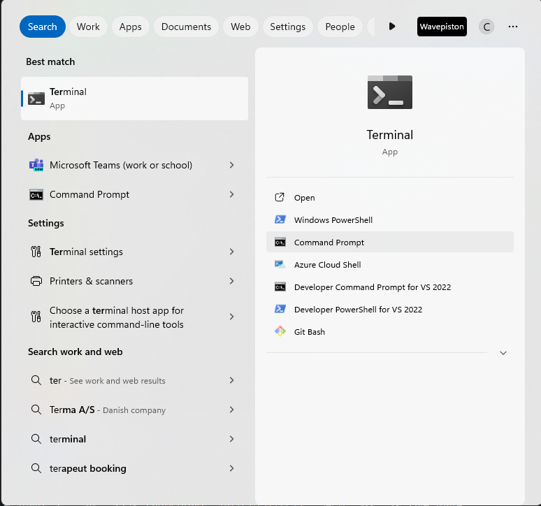

# DTU-Python
### Getting the application
Either follow the steps below or download the release.
1. **Choose location** or make a new one and navigate to the folder.
2. **Open a terminal**
    
2. **Download the program** using git clone.
    ```
    git clone https://github.com/Chrisser1/DTU-Python.git
    ```
## Make changes to the code
In the following chapters we will show you how you can make changes to the codebase and apply them.

### Environment Setup
How to setup the environment is described here

#### Prerequisites
Ensure you have [Anaconda](https://www.anaconda.com/products/individual) or [Miniconda](https://docs.conda.io/en/latest/miniconda.html) installed on your system to handle package management and environments.

#### Create Anaconda Environment
To set up your environment for the first time, follow these steps:

1. **Open a terminal** or Anaconda Prompt.
2. **Navigate to the project's root directory**:
    ```
    cd path/to/your/project
    ```
3. **Create the environment** from the `environment.yml` file. This file contains all necessary package dependencies:
    ```
    conda env create -f environment.yml
    ```
4. **Activate the newly created environment**:
    ```
    conda activate Name
    ```

### Committing Changes with Git

After making changes to the code, you'll need to commit those changes to your Git repository. Below are instructions for committing using both VS Code and the terminal.

#### Using VS Code

1. **Open your project in VS Code**.
2. **Navigate to the Source Control tab** by clicking on the Git icon on the left sidebar.
3. **Stage your changes**:
    - You’ll see a list of changes under the "Changes" section.
    - Click the `+` icon next to each file to stage them, or click the `+` next to "Changes" to stage all changes.
4. **Commit your changes**:
    - After staging, enter a commit message in the text box at the top.
    - Click the checkmark icon above the text box to commit your changes.
5. **Push your changes**:
    - Click the three-dot menu in the Source Control tab and select "Push" to upload your changes to the remote repository.

#### Using the Terminal

1. **Open a terminal**.
2. **Stage your changes**:
    ```bash
    git add .
    ```
    - This stages all the changes you have made. Alternatively, you can stage specific files by replacing `.` with the file names.
3. **Commit your changes**:
    ```bash
    git commit -m "Your commit message here"
    ```
    - Replace `"Your commit message here"` with a meaningful message describing the changes you made.
4. **Push your changes to the remote repository**:
    ```bash
    git push
    ```

By following these steps, your changes will be committed and pushed to the repository.
